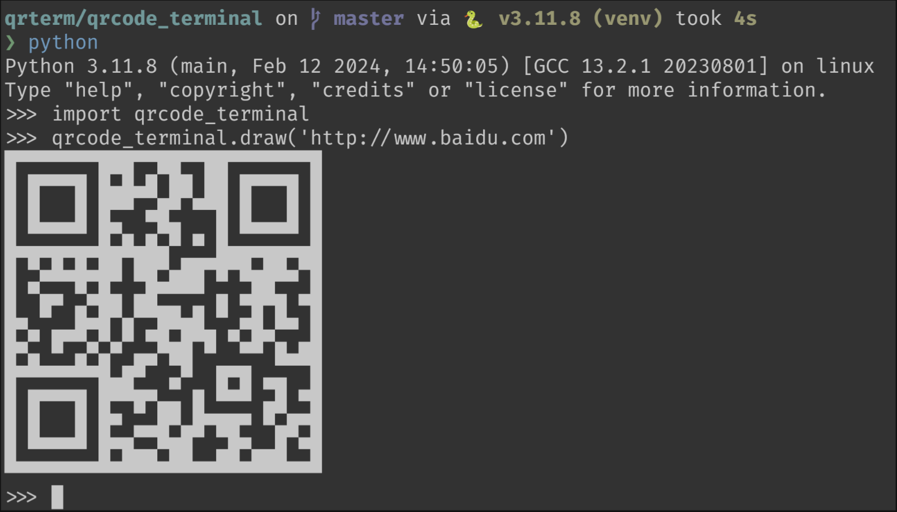

# Python QRCode Terminal
You can draw QR codes in your terminal by Python:


## Install Dependencies
You need install these:
```shell    
yum install -y python-devel zlib-devel libjpeg-turbo-devel
pip install pillow qrcode
```

## Install
Can be installed with pip:
``` shell
pip install qrcode-terminal
```

## Useage

### As Library
```python
import qrcode_terminal
qrcode_terminal.draw('http://www.baidu.com')
```

### In Terminal
``` shell
qrcode-terminal-py -d http://www.baidu.com
echo "http://www.baidu.com" | qrcode-terminal-py
```
