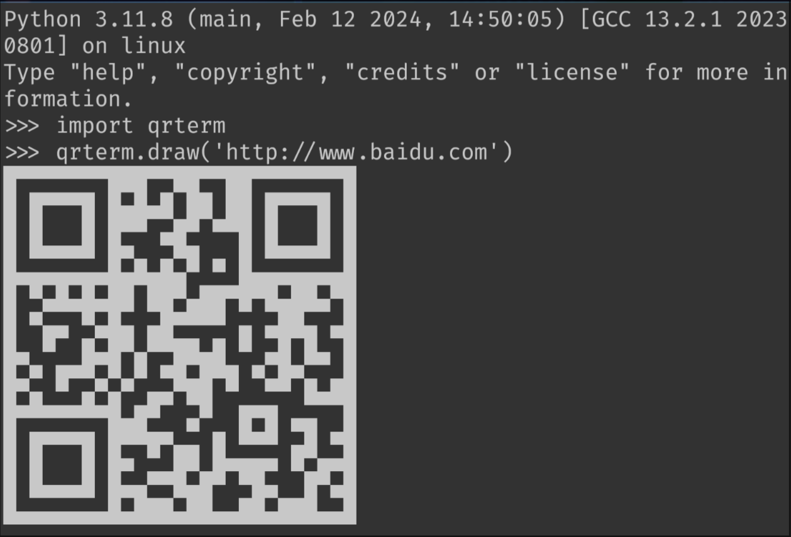
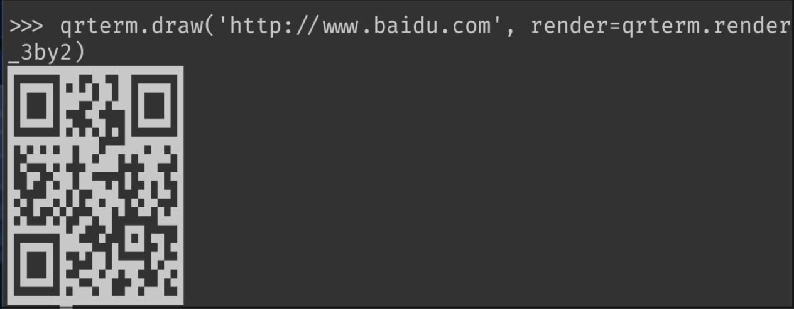

# Python QRCode Terminal
You can draw QR codes in your terminal by Python:

<p align="center">
    
</p>

## Install
Can be installed with pip:
``` shell
pip install git+https://github.com/glyh/qrterm
```

## Usage

### As Library
```python
import qrterm
qrterm.draw('http://www.baidu.com')
```

### In Terminal
``` shell
qrterm-py -d http://www.baidu.com
echo "http://www.baidu.com" | qrterm-py
```

### Scaling
Out of the box we use 2 by 1 unicode blocks, you can also opt-in to use a 3 by 2 unicode block to make the QR-code even smaller:

```
import qrterm
qrterm.draw('http://www.baidu.com', render=qrterm.render_3by2)
```

<p align="center">
    
</p>

## TODO
- [ ] See [Unicode Block Elements](https://en.wikipedia.org/wiki/Block_Elements) for more compression.
- [ ] Support ASCII only clients
